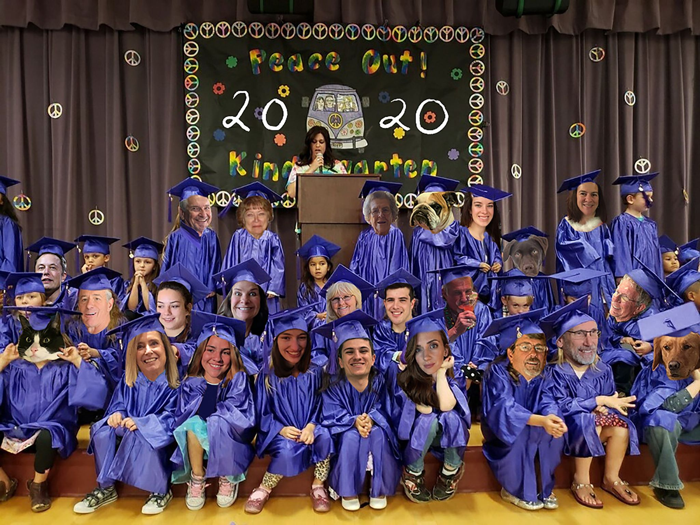

## Logan Harless
Current full-stack engineer/technical consultant @Credera. Interested in web scraping, NLP, Prediction/Financial/Crypto markets, mobile app development and more with
Java, Node/Typescript, Python... see my resume or LinkedIn for the full list :)

Always looking to build with others, feel free to reach out!

### Public projects
[discord_site_monitor](https://github.com/EllAchE/discord_site_monitor) - A bot for scraping webpages in a wide variety
of formats and sending discord notifications based on extracted data and customizable logic . Node/Typescript/Discord.js

[discord_embed_parser](https://github.com/EllAchE/discord_embed_parser) - A bot for regex-based filtering of embeds
sent in a discord guild. Node/Typescript/Discord.js

[kalshi_cli](https://github.com/EllAchE/kalshi_cli) - Python scripts for interacting with Kalshi API, executable via CLI. Python (In progress)

[*nba_tipoff](https://github.com/EllAchE/nba-tipoff-scraper) - Comparison of predictive ability of elo, glicko2 and trueskill algorithms and forecasting of first score via XGBoost. Python/Beautiful Soup/XGBoost. *This is publicly available primarily so that I could discuss/display the work I did.

### Misc.

#### [LinkedIn](https://www.linkedin.com/in/logan-harless/)
#### [Resume (as of Sep. 2021)](./LH_resume_Sep2021_no_pii.pdf). This link will be broken until I remove some PII

